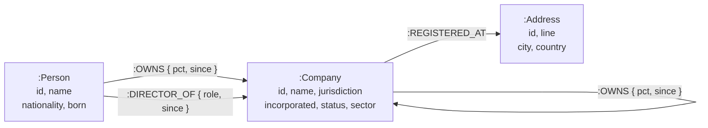

# Ownership Lens
**Live demo:** https://ownership-lens.onrender.com
**Screen recording:** <!-- REPLACE with your video link -->
**Who really owns this company?**

Corporate registries publish only the *immediate* shareholder of a company. When that
shareholder is itself a company — registered in another country, owned by a third company,
and so on — the actual human beneficiary can sit four or five layers away. Regulators call
that person the *ultimate beneficial owner*, and most jurisdictions require disclosure once
someone controls **25% or more**.

Ownership Lens is a web application that traces those chains and computes effective
ownership, using [CognoDB](https://console.cognodb.com) as its graph data layer.

**Live demo:** <!-- REPLACE with your Render URL -->
**Screen recording:** <!-- REPLACE with your video link -->

---

## The problem, in one screen

Search **Orion Retail India Private Limited**. Its registered shareholders look ordinary:

| Direct shareholder | Type | Stake |
|---|---|---|
| Meridian Commerce Holdings Pte Ltd | Company | 62% |
| Vantage South Partners LLC | Company | 20% |
| Kavya Raman | Person | 18% |

No individual holds more than 18%. On a filing form, **nobody would be declared a
beneficial owner.**

Now follow the chain. Ownership Lens multiplies the stake along every path back to a
natural person:

| Ultimate beneficial owner | Path | Effective |
|---|---|---|
| **Isabelle Moreau** | Trident → Meridian Global → Meridian Commerce → Orion | **27.28%** ⚑ |
| Aleksandr Volkov | Meridian Global → Meridian Commerce → Orion | 22.32% |
| Kavya Raman | direct | 18.00% |
| Lena Fischer | Meridian Commerce → Orion | 12.40% |
| Marcus Adeyemi | Vantage South → Orion | 12.00% |
| Tomas Silva | Helix Capital → Vantage South → Orion | 2.40% |

`100% × 55% × 80% × 62% = 27.28%`

Isabelle Moreau is four hops away, crosses the disclosure threshold, and appears nowhere in
the shareholder register. Finding her is a graph traversal.

---

## Why a graph database?

Three properties of this problem make a relational schema fight back.

**1. The depth is not known in advance.**
An ownership chain might be one hop or six. In SQL that is a recursive CTE, and every extra
requirement — carrying the running percentage product, capping depth, remembering the path
taken — has to be hand-built inside it. In Cypher the depth is part of the pattern:

```cypher
MATCH path = (owner:Person)-[:OWNS*1..6]->(target:Company {id: $company_id})
```

**2. The graph contains cycles, and cycles break recursive SQL.**
Company A owns B, B owns C, C owns A. A recursive CTE walking that structure never
terminates unless you write explicit visited-node tracking. The registry in this application
contains exactly such a ring, and finding it is a pattern match rather than an algorithm.

**3. The value is a product along a path, not a sum over rows.**
Effective ownership is `62% × 80% × 55% × 100%`. That is an aggregation over the *edges of a
path* — and the path is exactly the thing a relational model throws away. Cypher keeps it as
a first-class value:

```cypher
reduce(share = 1.0, r IN relationships(path) | share * r.pct / 100.0)
```

The honest summary: a relational schema can store this data perfectly well. What it cannot do
cheaply is *ask questions about the shape of the connections*. Every query in this application
is a question about shape.

---

## Data model



**Three labels, three relationship types.**

| Element | Purpose |
|---|---|
| `:Person` | A natural person. The terminus of every ownership chain. |
| `:Company` | A legal entity. May own and be owned. |
| `:Address` | A registered office. Shared addresses reveal shell clusters. |
| `:OWNS { pct, since }` | Shareholding. Originates from a Person *or* a Company — the self-referential Company→Company case is what creates depth. |
| `:DIRECTOR_OF { role, since }` | Board control, which is distinct from ownership. A nominee director may control a company they own none of. |
| `:REGISTERED_AT` | Ties a company to a physical address. |

**Design notes**

- `OWNS` is deliberately one relationship type shared by two source labels, rather than
  `PERSON_OWNS` and `COMPANY_OWNS`. This is what allows a single variable-length pattern to
  walk from a company all the way back to a human without knowing what it will pass through.
- Dates are stored as ISO-8601 **strings**, not temporal types. CognoDB implements openCypher,
  where temporal support is the most likely thing to differ from Neo4j. Strings sort correctly
  and cannot break the loader — a deliberate portability trade-off.
- Every variable-length pattern is **depth-capped** (`*1..6`, `*1..4`). The free `c0` tier is a
  burstable 0.5 vCPU instance; unbounded traversals are never sent to it.

---

## The dataset

`scripts/seed.py` loads **669 nodes and 1,532 relationships** — 313 companies, 228 people,
128 addresses, 754 ownership links and 465 directorships — in two parts.

**1. A hand-authored "spine"** — named entities arranged into structures that are interesting
on purpose:

- A **five-level ownership chain** ending at Isabelle Moreau (the 27.28% case above).
- A **three-company ownership cycle**: Helix Capital → Helix Ventures → Helix Holdings →
  Helix Capital.
- A **shell cluster**: five companies at *Unit 12-04, Ocean Financial Centre, Singapore*,
  all sharing one nominee director, Rohit Nambiar — who is also nominee director of Meridian
  Commerce, tying the cluster back into the Orion chain.

**2. A generated background registry** — 300 companies, 220 people, 120 addresses, so the
spine sits inside a realistic dataset rather than floating alone. The generator is seeded
(`random.Random(42)`), so every run produces an identical database.

The generated ownership graph is **acyclic by construction** — a company may only be owned by
one earlier in the list. The only cycle in the database is the hand-authored Helix trio, so
the cycle-detection query has a known, explainable answer rather than accidental noise.
Generated companies also draw from their own address pool, so the shell cluster stays a
genuine outlier instead of being diluted.

Not every result is hand-placed: Tomas Silva's **2.40%** stake in Orion Retail
(30% of Helix Capital × 40% of Vantage South × 20% of Orion) emerged from the graph.

The dataset is sized to stay human-legible in the UI while still exercising deep traversals.
All companies and people are fictional.

---

## The main queries

All Cypher lives in [`app/queries.py`](app/queries.py) as module-level constants. Parameters
are always passed to the driver separately — **no query in this project is assembled from user
input by string formatting.**

### Ultimate beneficial owners — the multi-hop traversal

```cypher
MATCH path = (owner:Person)-[:OWNS*1..6]->(target:Company {id: $company_id})
WITH owner,
     reduce(share = 1.0, r IN relationships(path) | share * r.pct / 100.0) * 100 AS path_pct,
     [n IN nodes(path) | n.name] AS chain,
     length(path) AS hops
WITH owner,
     sum(path_pct) AS effective_pct,
     collect({chain: chain, pct: path_pct, hops: hops}) AS paths
ORDER BY effective_pct DESC
LIMIT $limit
RETURN owner.id AS person_id,
       owner.name AS name,
       owner.nationality AS nationality,
       round(effective_pct * 100) / 100.0 AS effective_pct,
       paths
```

Walks 1–6 `OWNS` hops backwards from a company to every natural person with a stake.
`reduce()` multiplies the percentages along each path; `sum()` then combines a person's
multiple routes into one effective figure. The path itself is returned so the UI can show
*how* the conclusion was reached — an unexplained number would be useless to an investigator.

### Circular ownership — the query SQL finds awkward

```cypher
MATCH (c0:Company)-[r1:OWNS]->(c1:Company)-[r2:OWNS]->(c2:Company)-[r3:OWNS]->(c0)
WHERE c0.id < c1.id AND c0.id < c2.id AND c1.id <> c2.id
RETURN [c0.name, c1.name, c2.name, c0.name] AS ring,
       [r1.pct, r2.pct, r3.pct] AS percentages,
       3 AS hops
LIMIT $limit
```

Finds companies that ultimately own themselves. The pattern starts and ends at `c0`.
Requiring `c0` to hold the lowest id keeps only one rotation, so a three-company ring is
reported once rather than three times. Sibling queries cover rings of two and four companies
(see the dialect note under *Notes and limitations* for why this is not one variable-length
pattern).

This is the query that most justifies the database choice: a recursive CTE hits this data and
loops forever unless cycle detection is written by hand.

### Shared address clusters

```cypher
MATCH (c:Company)-[:REGISTERED_AT]->(a:Address)
WITH a, count(c) AS company_count
WHERE company_count >= $min_companies
MATCH (d:Person)-[:DIRECTOR_OF]->(c2:Company)-[:REGISTERED_AT]->(a)
WITH a, company_count, d, count(DISTINCT c2) AS companies_directed
WHERE companies_directed >= $min_shared
WITH a, company_count, d, companies_directed
ORDER BY companies_directed DESC, company_count DESC
LIMIT $limit
RETURN a.id AS address_id, a.line AS line, a.city AS city, a.country AS country,
       company_count, d.id AS director_id, d.name AS director_name, companies_directed
```

Addresses hosting several companies that *also* share a director — the registered-agent shell
pattern. Combines two different relationship types in one traversal.

The filter and the sort sit in separate `WITH` clauses deliberately: openCypher fixes the
subclause order as `ORDER BY / SKIP / LIMIT / WHERE`, so a `WHERE` written before `ORDER BY`
is a syntax error, and moving it after would apply `LIMIT` before the filter.

### Control footprint

```cypher
MATCH path = (p:Person {id: $person_id})-[:OWNS*1..6]->(c:Company)
WITH c,
     sum(reduce(share = 1.0, r IN relationships(path) | share * r.pct / 100.0) * 100) AS effective_pct,
     min(length(path)) AS hops
ORDER BY effective_pct DESC
LIMIT $limit
RETURN c.id AS id, c.name AS name, c.jurisdiction AS jurisdiction,
       round(effective_pct * 100) / 100.0 AS effective_pct, hops
```

The UBO query run in reverse: everything one person controls, directly or through any chain.

---

## Architecture

```
app/
├── config.py     Environment variables. Fails loudly if credentials are missing.
├── db.py         Driver lifecycle, health check, and the only two functions that
│                 touch the database. All failures collapse into DatabaseUnavailable.
├── queries.py    Every Cypher statement, plus thin Python wrappers.
├── main.py       FastAPI routes and rendering. No Cypher, no connection handling.
├── templates/    Jinja2 templates.
└── static/       Stylesheet.

scripts/
└── seed.py       Data generation and loading.
```

**Layering rule:** `main.py` never writes Cypher, `queries.py` never opens a connection, and
`db.py` never knows what a company is. Each file can be read on its own.

**Error handling.** `db.py` funnels every failure into a single `DatabaseUnavailable`
exception — DNS failure, TLS failure, timeout, bad credentials, rejected statement. A FastAPI
exception handler renders it as a friendly page with a link to `/health`, never a stack trace.
The outermost handler is deliberately a broad `except Exception`: the Neo4j driver signals
unreachability with several unrelated exception types, including a bare `ValueError` for an
unresolvable hostname.

**Parameterisation.** `run_query(cypher, params)` takes the statement and its parameters as
separate arguments and hands both to the driver. There is no code path in the application
that can build a query string from user input.

---

## Setup

### 1. Create a CognoDB instance

1. Sign up at [console.cognodb.com/signup](https://console.cognodb.com/signup) — the free tier
   needs no credit card.
2. Create a free **c0** instance and pick a region. It provisions in under a minute.
3. Copy the connection URI (`bolt+s://<instance-id>.databases.cognodb.com`) and the generated
   password for user `cognodb`. **The password is shown exactly once** — save it immediately.

### 2. Run locally

```bash
git clone <this-repo>
cd ownership-lens

python -m venv .venv
source .venv/bin/activate        # Windows: .venv\Scripts\Activate.ps1
pip install -r requirements.txt

cp .env.example .env             # Windows: copy .env.example .env
# edit .env with your CognoDB URI and password
```

Verify the connection before loading anything:

```bash
python -c "from app.db import check_connection; print(check_connection())"
# (True, 'Connected to CognoDB')
```

Load the data and start the app:

```bash
python -m scripts.seed
uvicorn app.main:app --reload
```

Open <http://127.0.0.1:8000> and search for **Orion Retail**.

### Environment variables

| Variable | Required | Description |
|---|---|---|
| `COGNODB_URI` | yes | `bolt+s://<instance-id>.databases.cognodb.com` |
| `COGNODB_USER` | yes | `cognodb` |
| `COGNODB_PASSWORD` | yes | Generated at instance creation |
| `COGNODB_DATABASE` | no | Leave blank for the server default |
| `APP_NAME` | no | Display name in the header |

`.env` is gitignored and never committed. `.env.example` documents the shape.

---

## Screenshots

| | |
|---|---|
|  |  |
| *Search across companies and people* | *Results with jurisdiction and status* |
|  |  |
| *UBO chains with the 25% threshold flagged* | *Circular ownership and shell clusters* |
|  |  |
| *Control footprint across the registry* | *Graceful handling when the DB is unreachable* |

---

## Notes and limitations

- **openCypher dialect difference.** CognoDB's variable-length expansion enforces *node*
  uniqueness, so a path cannot revisit a node and `(c)-[:OWNS*2..6]->(c)` never matches.
  Neo4j enforces *relationship* uniqueness, where the same pattern finds cycles directly.
  Both are valid openCypher. Cycle detection here therefore uses fixed-length patterns
  (2, 3 and 4 companies), one query per ring length, rather than a single variable-length
  traversal. The UBO and control-footprint queries are unaffected — they traverse acyclic
  chains, where the two rules agree.
- **Free-tier cold start.** The hosted demo runs on Render's free tier, which spins down after
  inactivity. The first request may take up to a minute.
- **Depth cap.** Traversals stop at 6 hops and rings at 4 companies. A real registry would need
  either a higher cap or a precomputed closure.
- **Read-only.** The application does not write to the graph. Data enters only through the
  seed script.
- **Fictional data.** All companies and people are invented. Any resemblance to real entities
  is coincidental.

## Tech stack

Python 3.11 · FastAPI · Jinja2 · Tailwind CSS · official `neo4j` Python driver (Bolt) · CognoDB